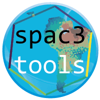

# spac3tools

The R package `spac3tools` contains a suite of landscape or space
 (environmental dynamic layers) that are used as input for the general
 engine for eco-evolutionary simulations
 [`gen3sis`](https://github.com/project-gen3sis/R-package).
 
## This package can

- Convert `landscapes.rds` files to `space.rds` files.
- Compress and decompress `space.rds` files.
- Convert `scape.rds` to `landscape.rds` files (in case not fixed directly over gen3sis)
