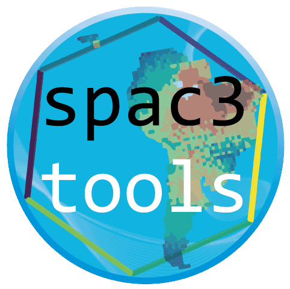

# spac3tools
 R-package spac3tools contains a suit of landscape or space (environmental dynamic layers) that are used as input for the general engine for eco-evolutionary simulations gen3sis [project-gen3sis git](https://github.com/project-gen3sis/R-package).
 
## This package can
- convert landscapes.rds files to space.rds files.
- compress and decompress space.rds files.
- convert scape.rds to landscape.rds files (in case not fixed directly over gen3sis)

